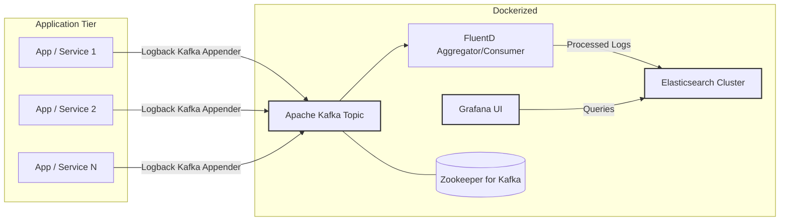

# Centralized Logging Pipeline using Kafka, FluentD, Elasticsearch & Grafana (EFK Stack)

This repository contains the configuration and setup for a scalable, centralized logging pipeline designed to collect, process, store, and visualize logs from distributed applications, particularly microservices. It leverages the power of Apache Kafka for decoupling and buffering, FluentD for log aggregation, Elasticsearch for storage and search, and Grafana for visualization (an EFK stack augmented with Kafka). The entire stack is containerized using Docker and orchestrated with Docker Compose for easy deployment and management.

This pipeline was developed to support the [E-Commerce Backend Microservices project](https://github.com/baiskhiyar/SpringBoot-Microservices-Overview) but can be adapted for any system requiring centralized logging.

###### **Developed By:** Ankit Kumar Baiskhiyar ([LinkedIn](https://www.linkedin.com/in/baiskhiyar/))

---

## Features

*   **Centralized Logging:** Aggregates logs from multiple sources into a single point.
*   **Decoupled & Resilient:** Uses Kafka as a buffer, preventing log loss during downstream component failures or high load scenarios. Applications asynchronously send logs to Kafka.
*   **Scalable:** Components like Kafka, FluentD, and Elasticsearch can be scaled independently based on load.
*   **Real-time Processing & Visualization:** Logs are processed and indexed in near real-time, allowing for immediate visualization and analysis in Grafana.
*   **Powerful Search & Analytics:** Leverages Elasticsearch's robust search capabilities.
*   **Easy Deployment:** Fully containerized stack managed by Docker Compose.

---

## Architecture

The pipeline follows this data flow:

1.  **Log Generation:** Applications (e.g., Spring Boot microservices) use a logging framework like **Logback** configured with a Kafka appender.
2.  **Log Shipping:** Structured logs are sent asynchronously to an **Apache Kafka** topic.
3.  **Log Aggregation/Processing:** **FluentD** instances act as Kafka consumers, pulling logs from the topic. FluentD parses, potentially transforms, and forwards the logs.
4.  **Log Storage & Indexing:** FluentD pushes the processed logs to **Elasticsearch**, which stores and indexes them.
5.  **Log Visualization & Analysis:** **Grafana** connects to Elasticsearch as a data source, providing dashboards for querying, visualizing, and alerting on log data.


## Technology Stack

*   **Message Broker:** Apache Kafka
*   **Log Collector/Forwarder:** FluentD
*   **Search & Analytics Engine:** Elasticsearch
*   **Visualization:** Grafana
*   **Supporting:** Zookeeper (for Kafka)
*   **Containerization & Orchestration:** Docker, Docker Compose
*   **Application Logging Framework (Example):** Logback (typically configured within the applications sending logs)

---

## Repository Contents

*   `docker-compose.yml`: Defines and configures all the services (Kafka, Zookeeper, FluentD, Elasticsearch, Grafana) required for the pipeline.
*   `fluentd/conf/fluentd.conf` (or similar): Configuration file for FluentD, defining sources (Kafka input), matching rules, filters, and outputs (Elasticsearch).
*   `fluentd/Dockerfile` (Optional): If custom FluentD plugins or configurations are needed.
*   `.env` (Optional): For environment variables used in `docker-compose.yml`.
*   (Potentially) Example Grafana dashboard configurations or provisioning files.
*   (Potentially) Example Logback configurations (`logback-spring.xml`) for client applications.

---

## Prerequisites

*   **Docker:** Ensure Docker engine is installed and running. ([Install Docker](https://docs.docker.com/engine/install/))
*   **Docker Compose:** Ensure Docker Compose is installed (usually included with Docker Desktop, may need separate install on Linux). ([Install Docker Compose](https://docs.docker.com/compose/install/))
*   **Sufficient Resources:** Allocate adequate RAM (e.g., 4GB+ recommended, especially for Elasticsearch) and CPU resources to Docker.
## Setup and Usage

1.  **Clone the Repository:**
    ```bash
    git clone https://github.com/baiskhiyar/Logging-Pipeline.git
    cd Logging-Pipeline
    ```

2.  **Start the Pipeline:**
    ```bash
    docker-compose up -d
    ```
    This command will pull the necessary Docker images and start all the services defined in `docker-compose.yml` in detached mode.

3.  **Verify Services:** Check if all containers are running:
    ```bash
    docker-compose ps
    ```
    Or using the docker command:
    ```bash
    docker ps
    ```
    You should see containers for Kafka, Zookeeper, FluentD, Elasticsearch, and Grafana listed as 'Up'.

4.  **Access Grafana:**
    *   Open your web browser and navigate to `http://localhost:3000` (or the port mapped for Grafana in `docker-compose.yml`).
    *   Default login is often `admin` / `admin` (check the Grafana service definition in `docker-compose.yml` for potential environment variables overriding this).
    *   Configure Elasticsearch as a data source in Grafana (usually pointing to `http://elasticsearch:9200` from within the Docker network).
    *   Create dashboards to visualize logs (e.g., using Lucene/KQL queries for Elasticsearch).

5.  **Configure Applications to Send Logs:**
    *   Applications need to be configured to send logs to the Kafka instance running within this pipeline.
    *   **Example (Spring Boot with Logback Kafka Appender):**
        *   Add the necessary Maven/Gradle dependency (e.g., `logstash-logback-encoder` or a dedicated Kafka appender library like `logback-kafka-appender`). Example using `logback-kafka-appender`:
            ```xml
            <!-- pom.xml (Maven) Dependency -->
            <dependency>
                <groupId>com.github.danielwegener</groupId>
                <artifactId>logback-kafka-appender</artifactId>
                <version>0.2.0-RC2</version> <!-- Check for latest version -->
            </dependency>
            <dependency>
                <groupId>net.logstash.logback</groupId>
                <artifactId>logstash-logback-encoder</artifactId>
                <version>7.4</version> <!-- Or compatible version -->
             </dependency>
            ```
        *   Configure your `logback-spring.xml` (or `logback.xml`):
            ```xml
            <configuration>
                <appender name="KAFKA" class="com.github.danielwegener.logback.kafka.KafkaAppender">
                    <!-- Use LogstashEncoder for structured JSON logs -->
                    <encoder class="net.logstash.logback.encoder.LogstashEncoder">
                        <providers>
                            <timestamp>
                                <timeZone>UTC</timeZone>
                            </timestamp>
                            <pattern>
                                <pattern>
                                    {
                                    "severity": "%level",
                                    "service": "${springAppName:-}",
                                    "trace": "%X{traceId:-}",
                                    "span": "%X{spanId:-}",
                                    "pid": "${PID:-}",
                                    "thread": "%thread",
                                    "class": "%logger{40}",
                                    "message": "%message"
                                    }
                                </pattern>
                            </pattern>
                        </providers>
                    </encoder>
                    <topic>my-app-logs</topic> <!-- CHANGE to your desired Kafka topic -->
                    <keyingStrategy class="com.github.danielwegener.logback.kafka.keying.NoKeyKeyingStrategy" />
                    <deliveryStrategy class="com.github.danielwegener.logback.kafka.delivery.AsynchronousDeliveryStrategy" />
                    <!-- IMPORTANT: Configure Broker List -->
                    <producerConfig>bootstrap.servers=localhost:9092</producerConfig> <!-- CHANGE 'localhost:9092' if app runs outside docker or needs different host/port -->
                    <!-- Add other producer configs as needed, e.g., security -->
                    <!-- <producerConfig>acks=0</producerConfig> --> <!-- For higher throughput, less guarantee -->
                </appender>

                <root level="INFO">
                    <appender-ref ref="KAFKA" />
                    <!-- Add other appenders like CONSOLE if needed for local dev -->
                    <!-- <appender-ref ref="CONSOLE" /> -->
                </root>
            </configuration>
            ```
        *   **Note:** Ensure the `bootstrap.servers` points correctly to the Kafka broker (e.g., `kafka:9092` if the app runs within the same Docker network as defined in `docker-compose.yml`, or `localhost:9092` if the app runs on the host machine and the port is mapped). Adjust the topic name (`my-app-logs`) to match what FluentD is configured to consume.

6.  **Stopping the Pipeline:**
    ```bash
    docker-compose down
    ```
    To stop and remove the containers. Add the `-v` flag (`docker-compose down -v`) if you also want to remove the data volumes (use with caution - logs stored in Elasticsearch volumes will be lost!).
    
## Configuration

*   **`docker-compose.yml`:** Check this file for service definitions, port mappings (e.g., Grafana's `3000`, Elasticsearch's `9200`, Kafka's `9092`), volume mounts (for data persistence), and environment variables (e.g., credentials, cluster names). You might adjust ports to avoid conflicts on your host machine or change resource limits if needed.
*   **`fluentd/conf/fluentd.conf`:** This is the core configuration for FluentD. Modify the `<source>` directive(s) to correctly connect to your Kafka broker(s) (`brokers kafka:9092`, or `localhost:9092` depending on network setup) and specify the Kafka `topics` to consume. Update the `<match>` directive(s) to configure the Elasticsearch output, including the `host` (`elasticsearch`), `port` (`9200`), `logstash_format` (`true`), `index_name` pattern (e.g., `fluentd-${tag}-%Y.%m.%d`), and potentially security settings if your Elasticsearch requires authentication.

---

## Troubleshooting

*   **Containers Not Starting/Restarting:**
    *   Check container logs: `docker-compose logs <service_name>` (e.g., `docker-compose logs fluentd`, `docker-compose logs elasticsearch`). Look for specific error messages like port conflicts, configuration errors, or resource issues.
    *   Ensure prerequisite services are running (e.g., Zookeeper must be up before Kafka can fully start).
    *   Check Docker resource allocation (RAM/CPU) - Elasticsearch in particular can be memory-intensive.

*   **Logs Not Appearing in Grafana/Elasticsearch:**
    1.  **Application Side:** Verify the application's logging configuration (`logback-spring.xml` or similar). Ensure the Kafka `bootstrap.servers` address and `topic` are correct and reachable from the application's environment. Check application logs for errors related to the Kafka appender.
    2.  **Kafka:** You can optionally use tools to check if messages are actually arriving on the Kafka topic (e.g., `kafka-console-consumer` inside the Kafka container).
    3.  **FluentD:** Check FluentD logs (`docker-compose logs fluentd`) for:
        *   Errors connecting to Kafka brokers.
        *   Errors connecting to Elasticsearch (`Could not push logs to Elasticsearch`).
        *   Parsing errors if complex filtering/parsing is configured.
        *   Ensure the `<source>` topic in `fluentd.conf` matches the topic the application is sending to.
        *   Ensure the `<match>` output configuration (Elasticsearch host/port) is correct.
    4.  **Elasticsearch:** Check Elasticsearch logs (`docker-compose logs elasticsearch`) for errors related to indexing, disk space, or cluster health. Use `curl http://localhost:9200/_cat/indices?v` (adjust host/port if needed) to see if indices matching your FluentD pattern are being created.
    5.  **Grafana:** Verify the Elasticsearch data source configuration in Grafana (URL: `http://elasticsearch:9200`). Ensure the correct index pattern (e.g., `fluentd-*-*`) is specified in the data source settings or within your dashboard queries. Check the time range selected in Grafana.

*   **Performance Issues:**
    *   Monitor resource usage of containers (`docker stats`). Kafka, FluentD, and especially Elasticsearch can consume significant resources.
    *   Consider tuning Kafka partitions, FluentD buffer settings, or Elasticsearch cluster settings (shards, replicas, JVM heap) for higher loads, though this is beyond basic setup.
